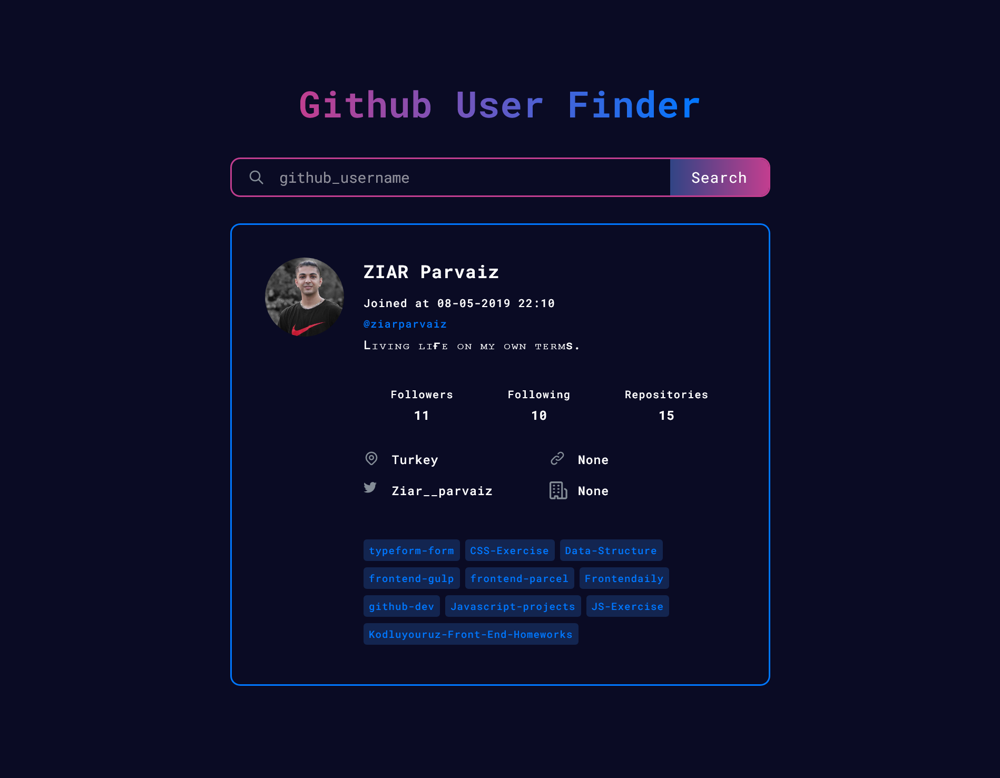

<h1 align="center">GitHub-Dev</h1>

<h3 align="center">
  <a href="https://github.com/ziarparvaiz/github-dev/issues/new?assignees=&labels=&template=bug_report.md&title=">Report a Bug</a>  
  <span> · </span>
  <a href="https://github.com/ziarparvaiz/github-dev/issues/new?assignees=&labels=&template=feature_request.md&title=">Request a Feature</a>
  <span> · </span>
  <a href="https://github.com/ziarparvaiz/github-dev/discussions">Ask a Question</a>
</h3>

<div align="center">
<br />
<a herf="./LICENSE"></a>
<a herf=".URL_"></a>
<a href="https://github.com/ziarparvaiz/github-dev/issues"></a>

<a href="https://prettier.io/"></a>
<a href="https://github.com/ziarparvaiz/github-dev/pulls"></a>

</div>

> Github User Card Using ReactJS & TailwindCSS



## Prerequisites

Make sure you have installed all of the following prerequisites on your development machine:

- Git - [Download & Install Git](https://git-scm.com/downloads). OSX and Linux machines typically have this already installed.
- Node.js - [Download & Install](https://nodejs.org/en/download) Node.js and the npm package manager. If you encounter any problems, you can also use this [GitHub Gist](https://gist.github.com/isaacs/579814) to install Node.js.

## Installation & Setup

```bash
git clone https://github.com/ziarparvaiz/github-dev.git
cd github-dev
npm install
npm start
```

## Project assistance

If you want to say thank you or/and support active development of `GitHub-Dev`:

- Add a ⭐️ [GitHub Star](https://github.com/ziarparvaiz/github-dev) to the project.
- Tweet about the `GitHub-Dev`.
- Write interesting articles about the project on [Dev.to](https://dev.to/), [Medium](https://medium.com/) or your personal blog.

Together, we can make `GitHub-Dev` better!

## 🤝 Contributing

First off, thanks for taking the time to contribute! Contributions are what make the open-source community such an amazing place to learn, inspire, and create. Any contributions you make will benefit everybody else and are greatly appreciated.

Please read [our contribution guidelines](./CONTRIBUTE.md) for details on our [code of conduct](./CODE_OF_CONDUCT.md), and the process for submitting pull requests to us.

## Versioning

We use [SemVer](https://semver.org) for versioning. For the versions available, see the [tags on this repository](https://github.com/ziarparvaiz/github-dev/tags).


## License

This project is licensed under the [GitHub-Dev](https://github.com/ziarparvaiz/github-dev) License - see the [LICENSE](./LICENSE). file for details
